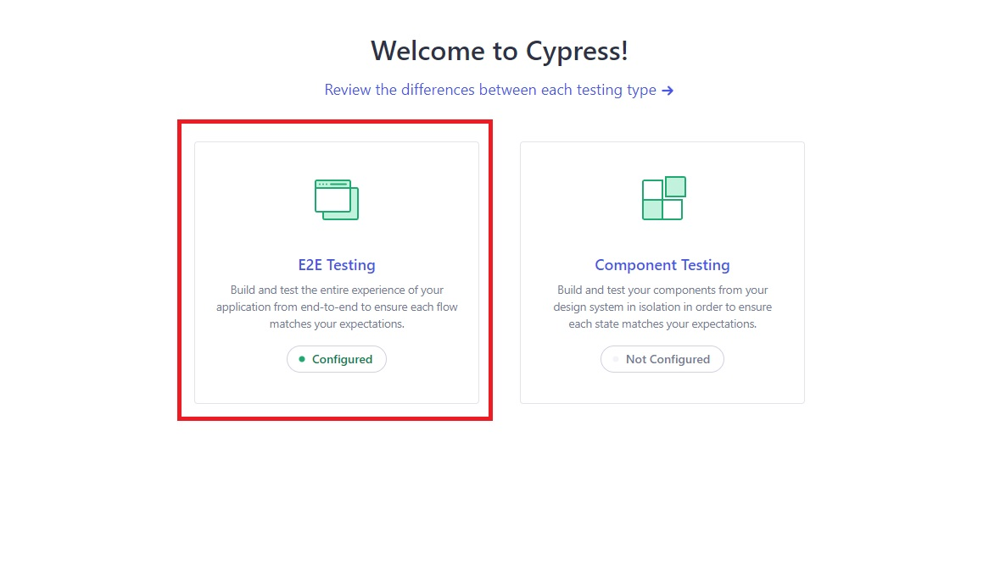
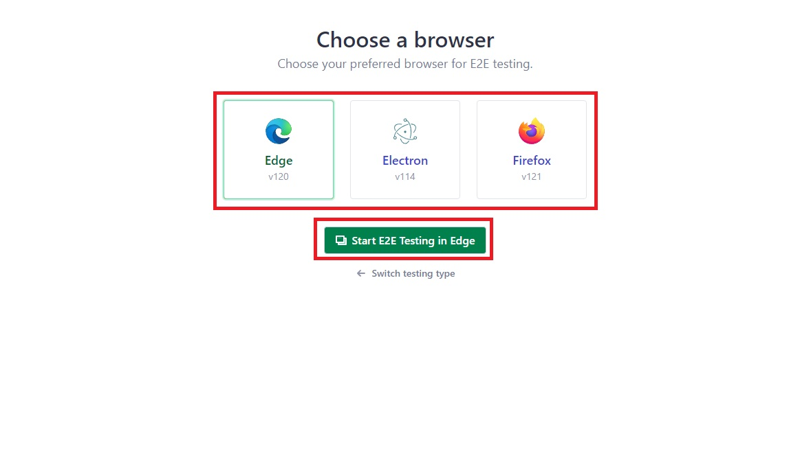
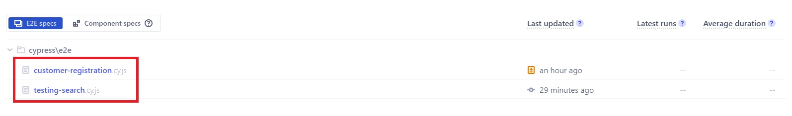

# Zadatci za selekcijski proces – QA Specialist

## Cypress prerequisites
+ [Node.js](https://nodejs.org/en) version 18.x, 20.x or higher
+ npm, pnpm or Yarn

## Before running the tests
An email account that wasn't previously used to register on Njuškalo is required
1. Create a file named user.json inside ./cypress/fixtures/ (create the fixtures folder if it's not present) folder (full path: `./cypress/fixtures/user.json`).
2. Inside the file add a json object containing a valid username, email and password like in the example below. Make sure the password contains the necessary characters as required on [Njuškalo register page](https://www.njuskalo.hr/registracija/kupac/).
```json
{
    "username": "user1234",
    "email": "user1234@gmail.com",
    "password": "!!PaS$word1234"
}
```
3. In the root directory run `npm install` or `yarn install` if using Yarn


## Running the tests
### Using the Cypress App
1. Start the app by running `npx cypress open` or `yarn run cypress open`
2. Select E2E testing on the left

3. Select your preferred browser and click on the green button below

4. When the browser opens you can select a spec from the list which will run the tests automatically


### Using the Command line
NOTE: The examples will show running the commands with npx only. Any other utility can be used.
+ `npx cypress run` will run all specs
+ `npx cypress run --spec "./cypress/e2e/testing-search.cy.js` will only run the `testing-search.cy.js` spec
+ You can check out other options on [Cypress docs](https://docs.cypress.io/guides/guides/command-line)

## Configuring what tests to run
+ To run only a single test inside a spec file append `.only` to the `it` function like so:
```javascript
// Only this test will run
it.only('User is logged in and is able to log out', function () {
    ...
})
```
+ To skip a test and run all the other ones append `.skip` to the `it` function like so:
```javascript
// This test will be skipped, but the others will run
it.skip('User is logged in and is able to log out', function () {
    ...
})
```
